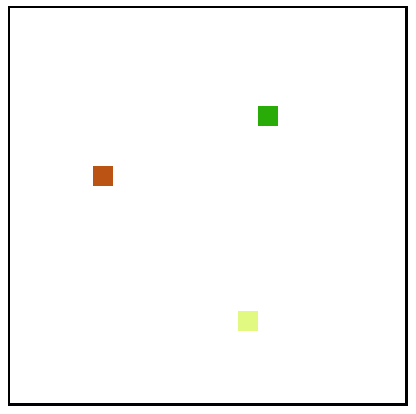

# Multiplayer Game Server with Websockets (Example Implementation)

This is a simple example implementation of a multiplayer game server built using Python and websockets. It serves as a demonstration of how you can create a basic multiplayer game infrastructure using WebSocket communication. Please note that this implementation is minimal and lacks advanced game features and security measures.

## Table of Contents

- [Requirements](#requirements)
- [How to Run](#how-to-run)
- [Client](#client)
- [Server](#server)
- [Disclaimer](#disclaimer)

## Requirements

To run this project, you need to have Python and the `websockets` library installed. You can install the required library using the provided `requirements.txt` file:

```bash
pip install -r requirements.txt
```

## How to Run

1. Clone this repository to your local machine.

2. Install the required dependencies as mentioned in the [Requirements](#requirements) section.

3. Run the server by executing `server.py`:

```bash
python server.py
```

4. Open the `client.html` file in a web browser to connect to the game.

## Client

The client is a simple HTML5 canvas-based interface that connects to the server using WebSocket. It displays player characters as colored rectangles and allows players to move their characters using arrow keys.



## Server

The server is built using Python and the `websockets` library. It handles player connections, assigns unique player IDs, and tracks player positions and colors. The server broadcasts updates to all connected clients, ensuring real-time synchronization of player positions.

## Disclaimer

Please be aware that this implementation is intended solely as an educational example to showcase the fundamentals of multiplayer game server development. In a production environment, you would need to consider various additional factors, including security, scalability, and more advanced gameplay features. This code is not suitable for a production-grade multiplayer game without substantial enhancements and improvements.